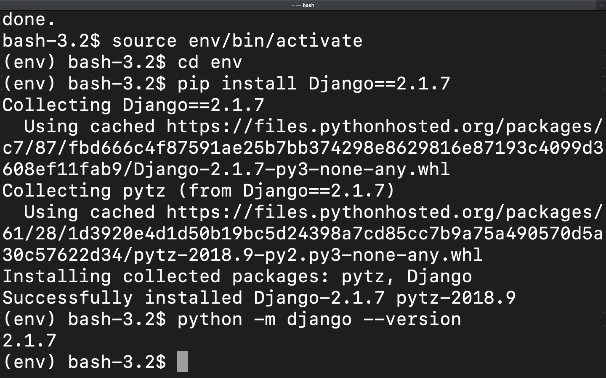
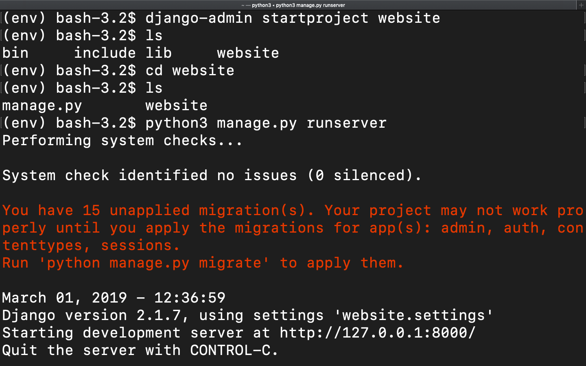

# Django

##  : Creating Web App

### Creating Virtual Environment
> ```
> // On macOS and Linux:
> $ python3 -m virtualenv env
>
> // On Windows:
> py -m virtualenv env
> 
> ```

### Acrivating Virtual Environment
> ```
> // On macOS and Linux:
> $ source env/bin/activate
>
> // On Windows:
> $ .\env\Scripts\activate
>
> Deactivating Virtual Environment
> $ deactivate
> ```


### Installing Django
> ```
> $ cd env      // Move inside the virtual environment directory here we have env as virtual environment.
> $ pip install Django==2.1.7
> ```

### Checking Installed version of the Django
> ```
> $ python -m django --version
> ```

### Creating Project
> ```
> $ django-admin startproject website    //This will create a website directory in your current directory
> ```


### Running on the local host
> ```
> $ python manage.py runserver      
> ```


After you have done everything right type the url in the browser and it will look as 


## : Deploying Web App
> ```
> $ pip3.6 install --user pythonanywhere
> $ pa_autoconfigure_django.py https://github.com/<your-github-username>/<repo-name>.git
> ```


### Deploying the Web App on pythonanywhere.com
> ```
> Create a account on https://www.pythonanywhere.com/user/techlearn/
> Start a Bash Console
> 
> $ git clone https://github.com/< username >/< myproject >.git
> $ mkvirtualenv --python=/usr/bin/python3.6 <name-of-virtual-env>
> $ source my_env_virtual/bin/activate
> $ pip freeze > requirements.txt     //To generate requirements.txt file
> $ pip install -r requirements.txt
>
> ```

### Changing the wsgi file
Remove everything and write the following piece of code
> ```
> # +++++++++++ DJANGO +++++++++++
> # To use your own django app use code like this:
> import os
> import sys
>
> # assuming your django settings file is at '/home/myusername/mysite/mysite/settings.py'
> path = '/home/myusername/mysite' # path to settings.py
> if path not in sys.path:
>     sys.path.append(path)
>
> os.environ['DJANGO_SETTINGS_MODULE'] = 'mysite.settings' # mysite is the project name
>
> ## Uncomment the lines below depending on your Django version
> ###### then, for django >=1.5:
> from django.core.wsgi import get_wsgi_application
> application = get_wsgi_application()
> ###### or, for older django <=1.4
> #import django.core.handlers.wsgi
> #application = django.core.handlers.wsgi.WSGIHandler()
> ```

### Books , References and Sources
- Virtual Environment and pip [Read More...](https://packaging.python.org/guides/installing-using-pip-and-virtualenv/)
- [Django Official Site](https://docs.djangoproject.com/en/2.1/intro/tutorial01/#creating-a-project)
